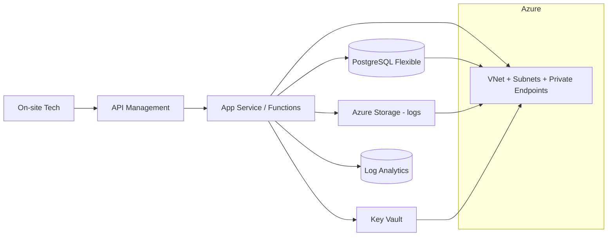

# 🛠️ FieldOps Support AI — Tier-1 Assistant

**Tagline:** Guided fixes for cameras, Wi-Fi, ports, and logins—with clean escalation packs for Tier-2.

## 0) Quick Facts
- **Cloud:** Azure — **Why:** enterprise identity (Entra ID), APIM gateway, Monitor/Log Analytics, Key Vault.
- **Phase Today:** Week-1 → Phase-1 (Infrastructure as Code)

## 1) What / How / Why / When / Where
- **What:** A Tier-1 assistant that runs guided diagnostics (Camera Power/DHCP, Wi-Fi slow, Wrong Port, Login issues) and auto-packages escalation context.
- **How:** Terraform → App Service/Functions + APIM → Service Bus (later) → GitHub Actions CI/CD → Azure Monitor dashboards → Entra/Key Vault → docs/runbooks.
- **Why:** Cut average handle time, boost first-fix rate, standardize Tier-1 excellence.
- **When:** During live tickets and hourly synthetic checks.
- **Where:** Mobile/web client → APIM → App Service/Functions in Azure; private VNets with Private Endpoints.

## 2) Architecture (Phase-1 slice)


## 3) Cloud Services (Phase-1 only)
- **Azure:** VNet, Subnets, App Service Plan, API Management (Developer), PostgreSQL Flexible (dev size), Storage (logs), Log Analytics, Key Vault
- **IaC:** Terraform (~> 1.6)
- **Environments:** dev, stage, prod (GitHub Environments + secrets)

## 4) Week-1 Plan — Phase-1 (IaC)
**Goal:** Stand up minimal Azure "bones" with Terraform and commit outputs.

- **Day 1 (Mon):** repo structure; Terraform backend/providers; envs/dev tfvars → `terraform plan` ok.
- **Day 2 (Tue):** VNet + subnets (app, data, private-endpoints) + NSGs.
- **Day 3 (Wed):** PostgreSQL Flexible + Storage (logs) + Private Endpoints.
- **Day 4 (Thu):** API Management + App Service Plan/Web App; Diagnostic Settings → Log Analytics.
- **Day 5 (Fri):** Key Vault + initial secret (DB password placeholder); outputs documented; screenshots/links; tag `v0.1-phase1`.

## 5) Commands (Phase-1)
```bash
cd infra
terraform init
terraform workspace new dev || terraform workspace select dev
terraform apply -var-file=envs/dev/main.tfvars
```

## 6) Branching, Releases, Environments
- **Branching:** Trunk-based. Feature branches → PR → checks → merge to main.
- **Releases:** `v0.1-phase1`, `v0.2-phase2`, ... `v1.0-beta`.
- **Environments:** dev (auto), stage (approval), prod (approval).

## 7) Issue Labels & PR Conventions
- **Phase:** `phase:1-iac`, `phase:2-backend`, `phase:3-ai/containers`, `phase:4-cicd/obs`, `phase:5-security/docs`
- **Cloud:** `cloud:azure`
- **Type:** `type:feat|fix|chore|docs|test`
- **Priority:** `priority:p1|p2`
- **Commits:** Conventional Commits (e.g., `feat(iac): add vnet + subnets`)

## 8) Acceptance Criteria (Phase-1)
- ✅ `terraform apply` completes cleanly.
- ✅ Outputs include: APIM URL, KV URI, PG FQDN, Storage URL.
- ✅ Diagnostic Settings linked to Log Analytics.
- ✅ Repo tagged `v0.1-phase1`.

## 9) Troubleshooting Drill (Phase-1)
- **Symptom:** APIM gateway returns timeout to App Service.
- **Check:** NSG rules; Private DNS zone for PE; health probe path.
- **Fix:** Allow correct ports in NSG; add Private DNS record; add `/healthz` stub.

## 10) Team Touchpoints & Ownership
- **Infra (Terraform):** owns VNet/Subnets/PE, APIM/AppSvc infra, PG, Storage, LA, KV; delivers `outputs.tf` and tfvars; **Lead:** Infra Eng.
- **Backend (Week-2+):** owns Functions/App Service code, `/healthz`, adapters; **Lead:** App Eng.
- **Observability:** owns Log Analytics workbooks, alerts baselines; **Lead:** SRE/Obs Eng.
- **Security:** owns Entra roles, KV policies, secrets rotation, PR security checks; **Lead:** Sec Eng.
- **QA/Support:** owns runbooks, synthetic checks, acceptance tests; **Lead:** QA Lead.
- **PM/Lead:** owns Phase gates (Phase-1 tag), scope, and cross-team review.

## 11) Next Phase Preview (Week-2)
- Backend stubs (`/services/api`) with `/healthz`.
- First diagnostic flow "Camera: No Power."
- Contract tests for vendor payloads.
- CI smoke test.
