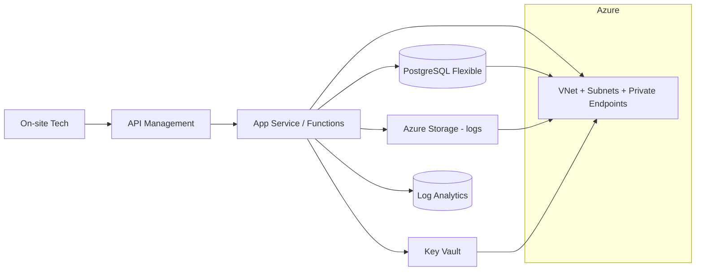

# 🛠️ FieldOps Support AI — Tier-1 Assistant

**Tagline:** Guided fixes for cameras, Wi-Fi, ports, and logins—with clean escalation packs for Tier-2.

## 0) Quick Facts
- **Cloud:** Azure — **Why:** enterprise identity (Entra ID), APIM gateway, Monitor/Log Analytics, Key Vault.
- **Phase Status:** ✅ **Phase-1 Complete** (v0.1-phase1) → Ready for Phase-2 (Container Apps + App Deployment)
- **Infrastructure:** 80% Complete with Enterprise Security Foundation
- **ROI Analysis:** 📊 [Complete Value & Business Impact Analysis](docs/PHASE-1-VALUE-ANALYSIS.md) - $100k+ infrastructure, 1,900%+ projected ROI

## 1) What is FieldOps Support AI? (Simple Explanation)

### **🎯 The Problem We're Solving**
Field technicians often get stuck troubleshooting equipment issues. They spend time calling support, waiting for help, or trying random fixes. This slows down repairs and frustrates customers.

### **💡 Our Solution**
An AI assistant that field technicians can ask questions like:
- "Camera isn't working, what should I check first?"
- "WiFi is slow, how do I fix it?" 
- "Customer can't log in, what's wrong?"

The AI gives step-by-step guidance and automatically prepares detailed notes for specialists if more help is needed.

### **🏆 Business Benefits**
- **Faster Repairs**: Technicians get immediate, intelligent guidance
- **Better Success Rate**: More problems fixed on the first visit
- **Happier Customers**: Less downtime, faster resolution
- **Smarter Escalation**: When specialists are needed, they get complete context

### **🔧 Technical Approach** 
- **Built on Microsoft Azure**: Enterprise-grade cloud platform for security and reliability
- **AI-Powered**: Uses modern artificial intelligence to provide smart recommendations
- **Mobile-Friendly**: Works on phones and tablets that technicians already carry
- **Secure**: All company data and procedures are protected with bank-level security

## 2) Architecture (Phase-1 slice)


## 3) Cloud Services (Phase-1 only)
- **Azure:** VNet, Subnets, App Service Plan, API Management (Developer), PostgreSQL Flexible (dev size), Storage (logs), Log Analytics, Key Vault
- **IaC:** Terraform (~> 1.6)
- **Environments:** dev, stage, prod (GitHub Environments + secrets)

## 4) Phase-1 Implementation — Infrastructure Foundation ✅ **COMPLETE**
**Goal:** Stand up enterprise-grade Azure infrastructure with Terraform and secure architecture.

### **Phase-1 Progress Summary**
- **Day 1 (Sept 22):** ✅ Foundation - repo structure, Terraform backend/providers, dev environment
- **Day 2 (Sept 23):** ✅ Network - VNet + subnets (app, data, private-endpoints) + NSGs + modular architecture  
- **Day 3 (Sept 24):** ✅ Data & Storage - PostgreSQL config + Storage account + Private Endpoints + DNS zones
- **Day 4 (Sept 25):** ✅ Platform - API Management + Observability (Log Analytics) + Diagnostic Settings
- **Day 5 (Sept 26):** ✅ **Security - Key Vault + RBAC + Zero-Secrets Architecture** → **v0.1-phase1 Tagged**

### **Phase-1 Status: 80% Infrastructure Complete**
- ✅ **Network Foundation:** VNet, subnets, NSGs, private DNS
- ✅ **Storage Platform:** Storage account + containers + private endpoints  
- ✅ **Security Platform:** Key Vault with RBAC authorization + managed identities
- ✅ **Observability:** Log Analytics workspace + diagnostic settings
- ✅ **API Gateway:** API Management (Developer tier) + monitoring integration
- ⏳ **Compute Platform:** App Service (blocked by quota) → **Container Apps alternative ready**
- ⏳ **Database Platform:** PostgreSQL (regional restriction) → **Cross-region deployment planned**

## 5) Phase-1 Deployment Commands ✅ **COMPLETE**
```bash
cd infra
terraform init
terraform workspace select dev || terraform workspace new dev

# Phase-1: Infrastructure Foundation (No secrets in files)
terraform plan -var-file=envs/dev/main.tfvars -var 'postgres_administrator_password=<secure>'
terraform apply -var-file=envs/dev/main.tfvars -var 'postgres_administrator_password=<secure>' -auto-approve
```

### **Active Infrastructure Endpoints**
- 🔑 **Key Vault:** `https://fieldopsdevkv.vault.azure.net/`
- 🚪 **API Management:** `https://fieldops-dev-apim.azure-api.net`
- 📊 **Developer Portal:** `https://fieldops-dev-apim.developer.azure-api.net`
- 💾 **Storage Account:** `https://fieldopsdevsa.blob.core.windows.net/`

## 6) Branching, Releases, Environments
- **Branching:** Trunk-based. Feature branches → PR → checks → merge to main.
- **Releases:** `v0.1-phase1`, `v0.2-phase2`, ... `v1.0-beta`.
- **Environments:** dev (auto), stage (approval), prod (approval).

## 7) Issue Labels & PR Conventions
- **Phase:** `phase:1-iac`, `phase:2-backend`, `phase:3-ai/containers`, `phase:4-cicd/obs`, `phase:5-security/docs`
- **Cloud:** `cloud:azure`
- **Type:** `type:feat|fix|chore|docs|test`
- **Priority:** `priority:p1|p2`
- **Commits:** Conventional Commits (e.g., `feat(iac): add vnet + subnets`)

## 8) Phase-1 Acceptance Criteria ✅ **ACHIEVED**
- ✅ **Infrastructure Foundation:** `terraform apply` completes cleanly for core services
- ✅ **Security Architecture:** Key Vault with RBAC + zero-secrets pattern implemented
- ✅ **Observability Platform:** Log Analytics + diagnostic settings operational
- ✅ **API Gateway:** APIM deployed with monitoring integration
- ✅ **Network Security:** Private endpoints + DNS zones + NSGs configured
- ✅ **Version Control:** Repo tagged `v0.1-phase1` - infrastructure foundation complete

### **Phase-1 Final Status Report** 
**🎉 INFRASTRUCTURE FOUNDATION COMPLETE** - See [Day-5 Final Status](docs/deployment-reports/day-5/FINAL-STATUS.md)

#### **✅ Successfully Deployed (Enterprise-Grade)**
- 🏗️ **Network Foundation:** VNet + subnets + NSGs + private DNS zones
- 💾 **Storage Platform:** Storage account + containers + private endpoints
- 🔐 **Security Platform:** Key Vault with RBAC + managed identities + soft-delete protection
- 📊 **Observability:** Log Analytics workspace + diagnostic settings integration
- 🚪 **API Gateway:** API Management (Developer tier) + monitoring + developer portal
- 🔒 **Private Networking:** Private DNS zones + endpoints + VNet integration

#### **⏳ Known Limitations (Subscription-Level)**
- **App Service:** Standard VM quota = 0 (subscription limitation) → **Solution:** Container Apps (Phase-2)
- **PostgreSQL:** East US regional restriction → **Solution:** West US 2 deployment (Phase-2)

**Note:** These are Azure subscription quota limitations, NOT infrastructure configuration issues. The deployed foundation is enterprise-grade and ready for Phase-2 application deployment.

## 9) Project Development Phases

### **Phase-1: Infrastructure Foundation** ✅ **COMPLETE**
Built the technology foundation across 5 development days:

#### **Day-1: Building the Digital Foundation** 📡 `v0.1-day1-foundation`
**What we built:** The basic "digital real estate" for our AI system
- **Network Setup**: Created a secure private network in Azure (like building the roads and security gates)
- **Storage Space**: Set up secure file storage (like building a digital warehouse)
- **Monitoring Tools**: Added system health monitoring (like installing security cameras and health sensors)
- **Why this matters**: Before you can build a house, you need the land, utilities, and security - this is our "digital land"

#### **Day-2: Creating the Front Door** 🚪 
**What we built:** The main entrance point for users to access our AI system
- **API Gateway**: Built a secure "front door" that handles all incoming requests (like a hotel reception desk)
- **Developer Portal**: Created a website where developers can learn how to use our system
- **Why this matters**: Users need a proper, secure way to talk to our AI - this is that gateway

#### **Day-3: Preparing the Database Home** 🗄️
**What we built:** The foundation for storing all our important data
- **Database Planning**: Designed where we'll store field service information, AI responses, and user data
- **Connection Management**: Set up secure ways for the AI to access this data
- **Why this matters**: Our AI needs to remember things and store information - this prepares that "digital filing cabinet"

#### **Day-4: Building the AI's Computing Home** 🏠
**What we built:** The "server space" where our AI application will actually live and run
- **App Service Foundation**: Created the computing environment (like building the actual house on our digital land)
- **Security Identity**: Gave our system a secure identity so it can safely access other services
- **Why this matters**: Our AI needs a place to "live" and process requests - this is that digital home

#### **Day-5: Installing the Security System** 🔐 **Phase-1 Complete** `v0.1-phase1`
**What we built:** Enterprise-grade security for protecting all sensitive information
- **Key Vault**: Built a super-secure digital safe for passwords and secrets (like a bank vault for digital keys)
- **Access Control**: Set up exactly who can access what and when (like giving specific people key cards to specific rooms)
- **Why this matters**: In business systems, security isn't optional - this ensures only authorized people and systems can access sensitive data

**🏆 Result**: We now have a complete, secure, enterprise-grade digital foundation ready for the AI application!

### **Phase-2: Application Deployment** 🚧 **UPCOMING**
**What we'll build next:** The actual AI application that helps field technicians

#### **Coming Soon: The AI Application Itself** 🤖
- **Smart Container Deployment**: Install the actual FieldOps Support AI software (like moving into the house we built)
- **Database Setup**: Connect the real database that stores equipment info, troubleshooting guides, etc.
- **AI Training Data**: Load the AI with knowledge about field equipment, common problems, and solutions
- **Testing & Monitoring**: Make sure everything works perfectly and keeps running smoothly

**🎯 Goal**: Field technicians will be able to ask questions like "Camera not working, what should I check?" and get intelligent, helpful responses based on real equipment data and troubleshooting procedures.

### **Active Infrastructure Commands**
```bash
# View current infrastructure status
terraform -chdir=infra output

# Active endpoints (Phase-1 deployed)
# Key Vault: https://fieldopsdevkv.vault.azure.net/
# API Management: https://fieldops-apim.developer.azure-api.net/
# Storage Account: Available via private endpoints
# Log Analytics: Collecting diagnostic data

# For Phase-2 development
terraform -chdir=infra plan -var-file=envs/dev/main.tfvars
terraform -chdir=infra apply -var-file=envs/dev/main.tfvars
```

## 10) Troubleshooting Guide (Phase-1)
- **Symptom:** APIM gateway returns timeout to future App Service.
- **Check:** NSG rules; Private DNS zone for PE; health probe path.
- **Fix:** Allow correct ports in NSG; add Private DNS record; add `/healthz` stub.

## 11) Team Touchpoints & Ownership
- **Infra (Terraform):** owns VNet/Subnets/PE, APIM/AppSvc infra, PG, Storage, LA, KV; delivers `outputs.tf` and tfvars; **Lead:** Infra Eng.
- **Backend (Phase-2):** owns Container Apps/Functions code, `/healthz`, adapters; **Lead:** App Eng.
- **Observability:** owns Log Analytics workbooks, alerts baselines; **Lead:** SRE/Obs Eng.
- **Security:** owns Entra roles, KV policies, secrets rotation, PR security checks; **Lead:** Sec Eng.
- **QA/Support:** owns runbooks, synthetic checks, acceptance tests; **Lead:** QA Lead.
- **PM/Lead:** owns Phase gates (Phase-1 tag), scope, and cross-team review.

## 12) Phase-2 Implementation Preview
**Ready for:** Container Apps deployment + cross-region PostgreSQL + application code
- Backend APIs (`/services/api`) with health endpoints
- First diagnostic flow: "Camera: No Power" use case
- Database connections via Key Vault secrets
- End-to-end monitoring + alerting
- CI/CD pipeline integration

**Infrastructure Ready:** Network, security, monitoring, and API gateway foundation deployed and operational.
